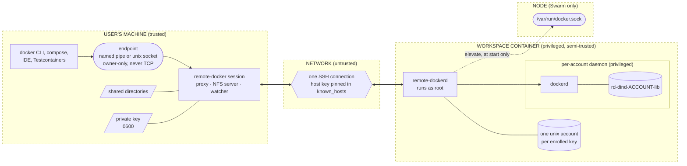
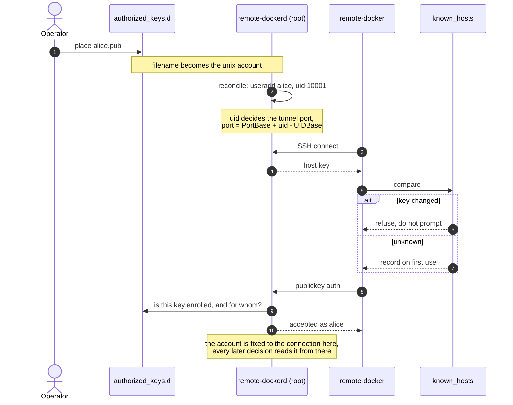
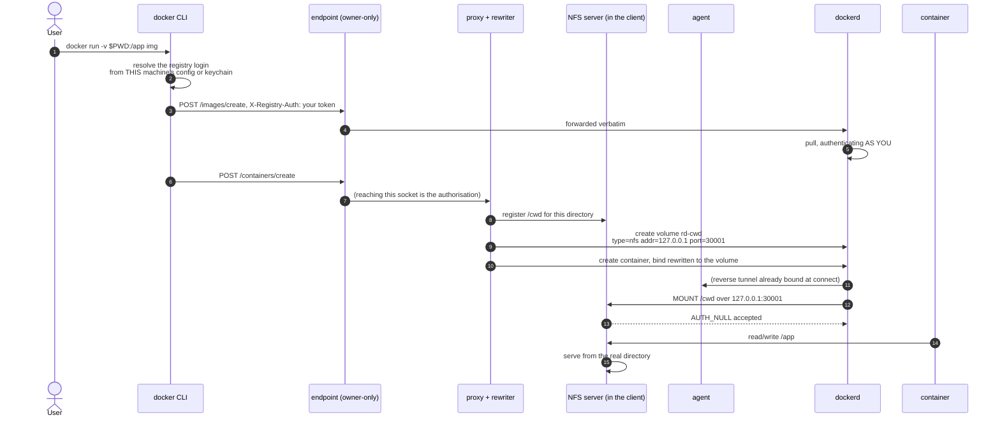
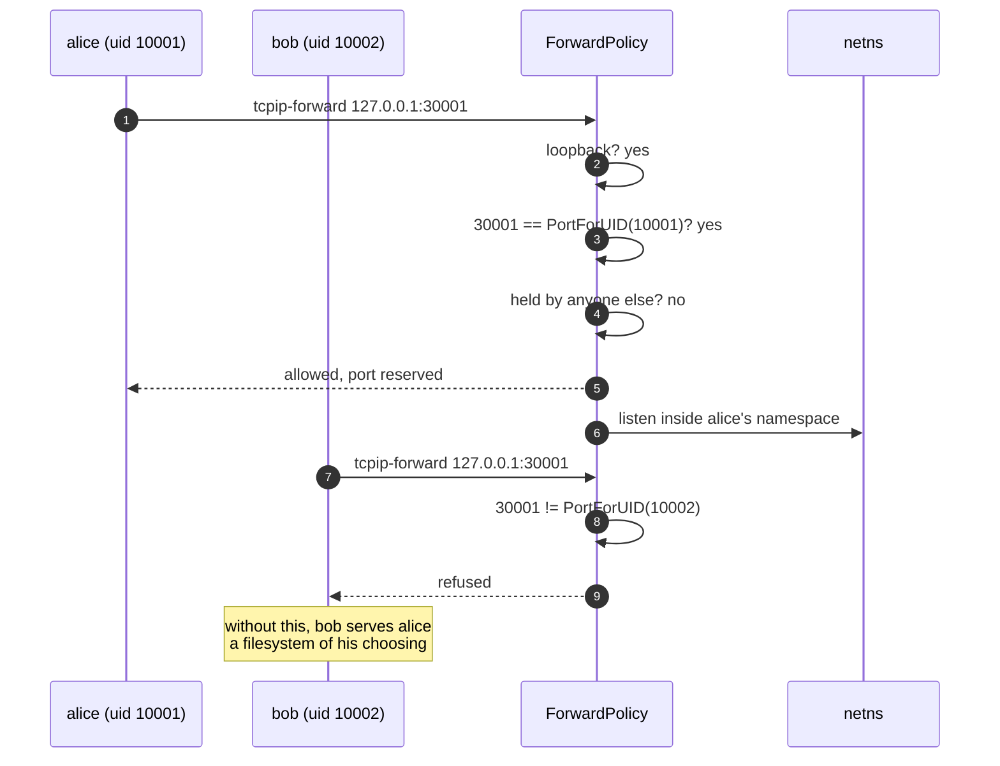
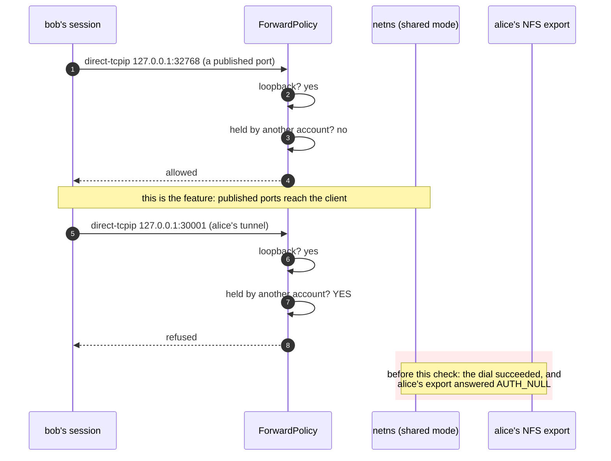
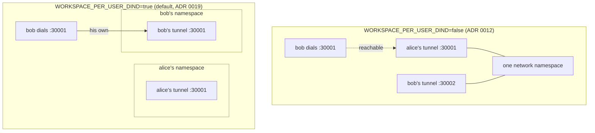
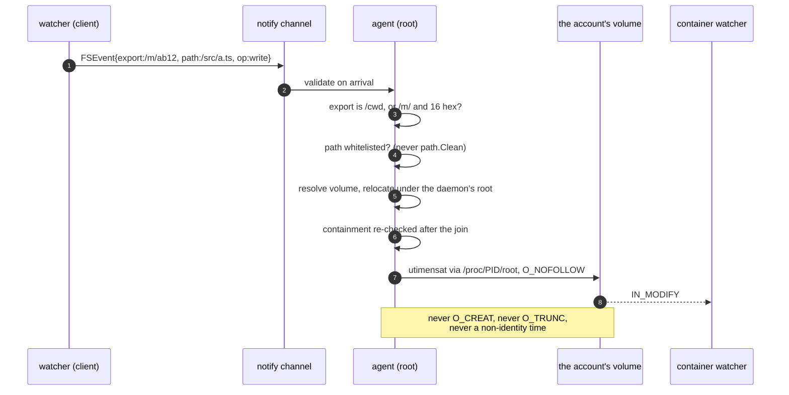
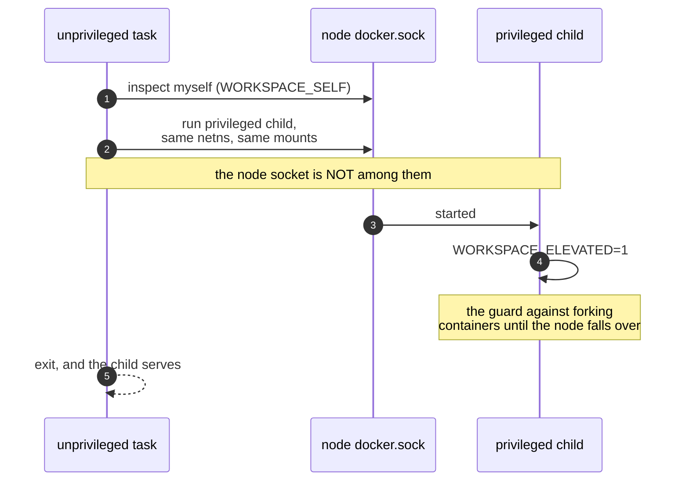

# Threat model

What this system trusts, what it does not, and where the checks are.

The model is the diagrams. Each flow below is drawn, and the STRIDE analysis
hangs off the arrows in that drawing: every point names the interaction it
applies to, the control, the file that enforces it, and the test that covers
it. Anything that cannot be pointed at an arrow is not analysis, and is either
missing from a diagram or belongs in [Accepted risks](#accepted-risks).

STRIDE letters are used where they apply and left out where they do not.
**S**poofing, **T**ampering, **R**epudiation, **I**nformation disclosure,
**D**enial of service, **E**levation of privilege.

## Assets, in the order they matter

1. **The files on the user's machine.** The client is a file server: it exports
   directories over NFS to the workspace. Nothing else here is worth as much,
   and every control below exists mainly to protect it.
2. **The user's SSH private key**, `~/.config/remote-docker/id_ed25519`, which
   is the only credential in the system.
3. **The registry credentials in `~/.docker/config.json`** or the keychain a
   credential helper fronts. They do not stay here: see flow 2.
4. **Each account's images, containers and volumes** on the workspace.
5. **The node's Docker socket**, where Swarm deployments run.

## Trust boundaries

Three properties of that picture decide everything below.

- **The arrows into the workspace carry authority, not requests.** An account's
  session can create containers, and containers on that daemon are root.
- **The arrow back out is a file server.** The workspace mounts the client, not
  the other way round, which is why the reverse tunnel is the most sensitive
  thing in the system.
- **The endpoint has no authentication of its own.** Reaching it *is* the
  authorisation, which is why it is owner-only and never a TCP port.

---

## Flow 1: enrolment and connection

**S — impersonating an account (5, 8).** Public-key only:
`PublicKeyHandler` is the sole authenticator and no password handler is set
(`agent/internal/sshd/server.go`). A key authenticates the account it is
enrolled against and no other. Accounts get `usermod -p '*'` rather than a
locked password, because some sshd builds refuse keys for locked accounts.

**S — impersonating the workspace (2–4).** The host key is compared against
`known_hosts`; a *changed* key is refused rather than prompted for, because
there is no interactive user on the far side of an automated tunnel
(`client/internal/sshx/hostkey.go`). First use records the key.

**T — forging enrolment (1).** Writing `authorized_keys.d` is the operator's
privilege and is outside the boundary: whoever can put a file there could
already run containers on the node. The directory is mounted read-only into
the workspace, and is polled as well as watched because inotify does not fire
for changes made on another host of a shared filesystem.

**E — uid collisions (3).** The uid decides the port, so two accounts sharing
a uid would share a tunnel. `accounts.Sync` sorts the key files so allocation
is deterministic; ranging a map here once made it differ run to run.
*Covered by* `core-agent/accounts` tests.

**R.** Sessions, forwards and refusals are logged with the account name. There
is no audit of what happened *inside* a container, and none is claimed.

---

## Flow 2: a bind mount becomes an NFS volume

The flow the whole project exists for, and the one that puts the user's files
on the wire.

**E — anything that reaches the endpoint has the workspace (2, 3).** There is
no per-request authorisation: the Docker API is the authority, so a local
process that can open the socket can start a privileged container and mount any
path the user can read. The control is the endpoint itself: `0600` on unix
(`client/internal/proxy/listen_unix.go`), an owner-only SDDL on the Windows
named pipe (`listen_windows.go`), and never a TCP port. *Covered by*
`proxy` lock and listen tests.

**I — the export is unauthenticated (9, 10).** The NFS server answers
`AuthFlavorNull` (`core-client/nfsserve/server.go`): anything that can
reach the port can read and write every registered share. There is no second
control on the NFS layer, which is why the loopback rule in flow 3 and the
holder rule in flow 4 carry the whole weight.

**I — your registry credentials leave this machine (2-5).** The daemon does the
pulling but has no logins of its own: the CLI resolves yours locally
(`RetrieveAuthTokenFromImage` against this machine's config or keychain) and
sends them in `X-Registry-Auth`, which the proxy forwards verbatim. So a
private pull hands a usable registry token to the workspace, where root can
read it out of the daemon's request. Encrypted in transit by SSH, exposed at
the far end to whoever runs the workspace. Nothing here mitigates that, and it
is the reason a workspace should be as trusted as the registries you use from
it. Docker works this way everywhere; it is only worth stating because here the
daemon is somebody else's.

**T — a path outside the shares (10, 11).** The export namespace is virtual:
only `/cwd` and `/m/<16 hex>` resolve, and lookups that climb out of a share
return nothing. *Covered by* `nfsserve/registry_test.go`.

**T — a volume that is not ours (4).** Volumes are only ever created, never
rewritten onto a name the user chose; garbage collection requires both the
`rd-` prefix and the managed label, since somebody may legitimately name a
volume `rd-backups`. *Covered by* `rewrite/gc_test.go`.

**D — the collector deleting a live volume (4).** A volume exists before any
container names it, and the daemon calls it unused in that window. `rewrite.Guard`
holds one lock across registering the share and creating the volume. Losing
that race is silent: the daemon recreates the missing volume as an empty local
one and the container starts with an empty directory. *Covered by*
`rewrite/guard_test.go` and `integration.sh` section 16.

---

## Flow 3: binding the reverse tunnel, and the refusal

**S/E — serving another account's mounts (6–8).** `ForwardPolicy.Allow`
(`agent/internal/sshd/forward.go`) enforces three rules in order: loopback
only, this account's own port and no other, one holder at a time. The middle
rule is the one that stops bob binding alice's port before she connects.
*Covered by* `forward_test.go` and `integration.sh` section 11.

**I — publishing the export beyond the container (2).** A non-loopback bind is
refused outright, because the export is unauthenticated and anything that
reaches it reads the client's files.

**D — losing a reservation on a failed bind (4, 5).** `Allow` is not a
predicate: it binds the port and arms the release. A listen that failed after
it once left the account's only port reserved by a forward that did not exist,
and every retry was refused while blaming a second session.

**E — releasing somebody else's reservation (4, 5).** The fix for D released by
ACCOUNT NAME, which is not who holds a port. Opening the client on a second
machine was enough to reach it: the second session's bind fails, its failure
path releases, and the first machine's live reservation is deleted. `AllowDial`
below then finds the port unheld and permits any other account to dial it, so
control 4 of flow 4 stops holding while the export it protects is still
serving. A reservation now carries a token minted when it was taken, and only
that token releases it. `TestAFailedBindDoesNotReleaseTheLiveHolder` walks the
whole sequence, ending at the dial being refused.

---

## Flow 4: reaching a published port, and the gap this model found

**I/E — reading another account's machine (6–8).** Found while writing this
document. With one daemon for everybody (ADR 0012) every account shares the
agent's network namespace, so `127.0.0.1:<alice's port>` is genuinely reachable
from bob's session, and what answers is her NFS export with `AuthFlavorNull`:
read and write access to the directories on her machine. Binding her port was
already refused; dialling it was not.

`ForwardPolicy.AllowDial` now refuses a port another account holds. It asks the
holder rather than a port range, because `PortForUID` counts up from 30000 and
docker publishes host ports from 32768, so refusing the range would refuse the
forwarding this feature exists for. *Covered by* `dial_test.go` and
`integration.sh` section 11, which uses the forward rather than merely
requesting it, since ssh opens the local listener before asking for the
channel.

**Why the default mode never had this.** A daemon per account (ADR 0019) binds
each tunnel inside that account's own namespace, where the address reaches
nothing of anyone else's:

**D — the workspace as a network relay (2).** Non-loopback destinations are
refused, so the workspace cannot be used to reach the network it sits on.

---

## Flow 5: replaying a change as a real syscall

The agent performs syscalls on the user's own files, as root, on instruction
from the client. ADR 0016 is why it exists; this is what keeps it safe.

**T/E — a root process told which path to touch (2–7).** Two independent
checks. `workspace.FSEvent.Validate` (`pkg/workcore-agent/notify.go`) whitelists the
export and the path spelling, deliberately without `path.Clean`, because
cleaning *repairs* a traversal into something plausible instead of refusing it.
Then `relocate` re-checks containment after joining onto the daemon's root,
because `path.Join` cleans: `/proc/42/root` joined to `/../../etc/shadow` is
`/proc/etc/shadow`, outside the root and looking correct. *Covered by*
`core-agent/notify/relocate_test.go`.

**T — replay mutating the user's data (7).** Replay may never create, truncate
or change content: the file may have been deleted between the client observing
the change and the agent replaying it, and the cost of being wrong is data
appearing in somebody's project. `O_CREAT`, `O_TRUNC` and non-identity
`utimensat` are all forbidden, and the measured `IN_CREATE` from
`open(O_CREAT)` is deliberately unused. *Covered by* `notify_test.go` and
`integration.sh` section 11d, which pins which syscall produces which event.

**T — a per-account daemon's answers are untrusted (5).** The daemon reports
its own volume mountpoints and the account is root inside it, so its answers
are input, not fact. `O_NOFOLLOW` and `AT_SYMLINK_NOFOLLOW` stopped being
tidiness the moment those paths left the agent's own filesystem.

**I — the channel carries paths, not contents.** Shipping data here would make
this a sync, which ADR 0014 explicitly is not.

---

## Flow 6: Swarm elevation

**E — the socket mount is the trust boundary (1, 2).** Access to the node's
Docker socket is root on the node. That is not a vulnerability introduced here:
whoever can deploy this stack can already start privileged containers. What
matters is that the socket is deliberately *not* replicated into the privileged
child, so a workspace account never reaches it. *Covered by*
`agent/internal/elevate/plan_test.go`.

**D — an elevation loop (5).** `WORKSPACE_ELEVATED` stops a misconfigured child
from elevating again and forking containers until the node dies.

---

## Accepted risks

Stated here rather than buried, because each is a deliberate trade.

- **Reaching the local endpoint is total authority.** Any process running as
  the user can start containers on the workspace and mount anything the user
  can read. The endpoint is owner-only and never TCP; there is no second
  factor, and a compromised user account is a compromised workspace account.
- **The NFS export is unauthenticated.** `AUTH_NULL`, by design: the transport
  is a loopback-only reverse tunnel inside a container, and the controls are
  the two forward rules. If a deployment ever publishes that port, everything
  in flow 2 is exposed.
- **A daemon per account is separation, not isolation.** Each per-account
  daemon runs privileged, which is root on whatever hosts it, so a determined
  account can still break out and reach another's. What it buys is that nobody
  sees anyone else's work *by accident* (ADR 0019). Genuine isolation is one
  workspace container per account.
- **Containers you run can write anything you shared with them.** That is the
  feature. A malicious image with `-v $HOME:/h` has your home directory.
- **A private pull gives the workspace a registry token of yours.** Flow 2 has
  the mechanism. There is no way around it while the remote daemon does the
  pulling, so treat a workspace as trusted with every registry you log into
  from it, and prefer tokens scoped to what that workspace needs.
- **Whoever deploys the stack is already root on the node** (ADR 0013).
- **No audit trail inside containers.** Sessions, forwards and refusals are
  logged; what a container did with a mounted directory is not.
- **Windows and macOS clients are less exercised.** The endpoint code and the
  file-watching backends are where they diverge, and only Linux takes a session
  end to end in CI. See the README's caveats.

## What changed because of this document

`ForwardPolicy.AllowDial`: in shared-daemon mode one account could dial
another's reverse-tunnel port and speak NFS to their client. Flow 4 has the
detail, ADR 0012 records it as a property of that mode, and both a unit test
and the shared-mode integration suite now cover it.
