# Threat model

What this system trusts, what it does not, and where the checks are.

The model is the diagrams. Each flow below is drawn, and the STRIDE analysis
hangs off the arrows in that drawing: every point names the interaction it
applies to, the control, the file that enforces it, and the test that covers
it. Anything that cannot be pointed at an arrow is not analysis, and is either
missing from a diagram or belongs in [Accepted risks](#accepted-risks). Every
point also has to name somebody from [Who this defends
against](#who-this-defends-against) who could actually arrive that way.

STRIDE letters are used where they apply and left out where they do not.
**S**poofing, **T**ampering, **R**epudiation, **I**nformation disclosure,
**D**enial of service, **E**levation of privilege.

## Assets, in the order they matter

1. **The files on the user's machine.** The client is a file server: it exports
   directories over NFS to the workspace. Nothing else here is worth as much,
   and every control below exists mainly to protect it.
2. **The user's SSH private key**, `~/.config/remote-docker/id_ed25519`, which
   is the only credential in the system.
3. **The registry credentials in `~/.docker/config.json`** or the keychain a
   credential helper fronts. They do not stay here: see flow 3.
4. **Each account's images, containers and volumes** on the workspace.
5. **The node's Docker socket**, where Swarm deployments run.

## Who this defends against

| adversary | how they arrive | what they get |
|---|---|---|
| a process running as the user | an npm postinstall, an editor extension, anything the user runs | the local endpoint, which is total authority over the workspace. The control is that it is owner-only and never TCP |
| another enrolled account | a colleague on the same workspace | their own daemon and their own tunnel port. Flows 4 and 5 are where that separation is, and it is separation rather than isolation |
| whoever operates the workspace | root there, legitimately | a registry token from a private pull, every directory exported while a session is live, and every container's contents |
| somebody on the internet | the ingress or a published SSH port, with no key | an HTTP upgrade and an SSH handshake. Past that, nothing: only an enrolled public key authenticates |
| the reverse proxy operator | terminates TLS in front of the workspace | traffic timing and sizes, and the ability to break or impersonate the endpoint. Not the SSH session inside it |
| an image the user runs | `docker run` on their own daemon | what was mounted into it, which is the feature. With host networking, more: see flow 3 |
| a pod in the same cluster | the pod network | the workspace's ports. The export is loopback inside a namespace of its own, so it is not among them |
| whoever holds a copy of the config directory | a synced folder, a backup, a stolen laptop | the private key at 0600, and a share record that is refused wholesale when another machine or account wrote it |

**Not modelled**, said once so the rest reads as deliberate: defects in
`x/crypto/ssh`, `coder/websocket`, the kernel's NFS client or `dockerd`; an
operator who is already root on the node; physical access to an unlocked
machine; and side channels. Each is either somebody else's boundary or a thing
no control here could hold.

## Trust boundaries

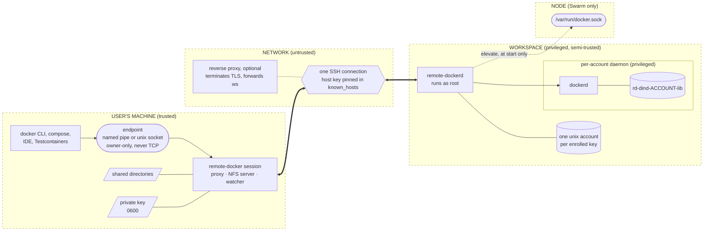

The workspace is a container under compose or Swarm, a machine on the user's
own hardware (ADR 0026), a VM (ADR 0025) or a pod (ADR 0035). The picture is
the same in all four: what moves is who owns the hardware the semi-trusted box
runs on, which changes the accepted risks and none of the controls.

Three properties of that picture decide everything below.

- **The arrows into the workspace carry authority, not requests.** An account's
  session can create containers, and containers on that daemon are root.
- **The arrow back out is a file server.** The workspace mounts the client, not
  the other way round, which is why the reverse tunnel is the most sensitive
  thing in the system.
- **The endpoint has no authentication of its own.** Reaching it *is* the
  authorisation, which is why it is owner-only and never a TCP port.

---

## Flow 1: enrolment and connection

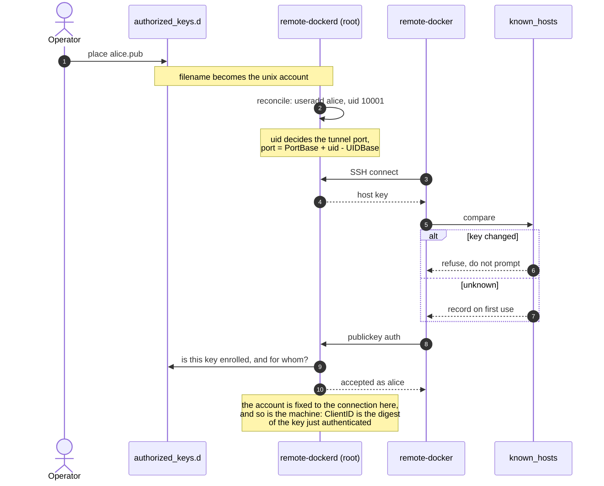

**S — impersonating an account (5, 8).** Public-key only:
`PublicKeyHandler` is the sole authenticator and no password handler is set
(`agent/internal/sshd/server.go`). A key authenticates the account it is
enrolled against and no other. Accounts get `usermod -p '*'` rather than a
locked password, because some sshd builds refuse keys for locked accounts.

**S — claiming to be another machine (8).** One account may be used from
several machines, and each gets its own export, port and volumes (ADR 0029).
The machine is `workspace.ClientID`, the digest of the key the agent has just
authenticated (`core/workspace/client.go`), so it cannot be claimed by asking:
an identifier the client sent would let one machine adopt another's volumes.
*Covered by* `core/workspace/export_test.go`.

**S — impersonating the workspace (2–4).** The host key is compared against
`known_hosts`; a *changed* key is refused rather than prompted for, because
there is no interactive user on the far side of an automated tunnel
(`core-client/keys/hostkey.go`). First use records the key. There is no default
host key rule anywhere in the transport: `core-client/tunnelclient` refuses a
nil callback by name rather than accepting anybody (ADR 0021).

**T — forging enrolment (1).** Writing `authorized_keys.d` is the operator's
privilege and is outside the boundary: whoever can put a file there could
already run containers on the node. The directory is mounted read-only into
the workspace, and is polled as well as watched because inotify does not fire
for changes made on another host of a shared filesystem.

**E — uid collisions (3).** The uid decides the port, so two accounts sharing
a uid would share a tunnel. `accounts.Sync` sorts the key files so allocation
is deterministic; ranging a map here once made it differ run to run.
*Covered by* `core-agent/accounts` tests.

**E — adopting a uid this workspace did not create (3).** `Ensure` keys on the
uid, because that is what the port and the file ownership come from. A uid held
by a user the workspace did not provision is refused rather than adopted:
adopting it would hand an enrolled key another user's files, which is a failure
that succeeds.

**R.** Sessions, forwards and refusals are logged with the account name. There
is no audit of what happened *inside* a container, and none is claimed.

---

## Flow 2: reaching the workspace through a proxy

The tunnel can be an HTTP upgrade rather than a TCP connection to an SSH port
(ADR 0034), which is how a workspace is reached through an ingress or a
corporate proxy. It adds a participant that sees the connection and cannot see
into it.

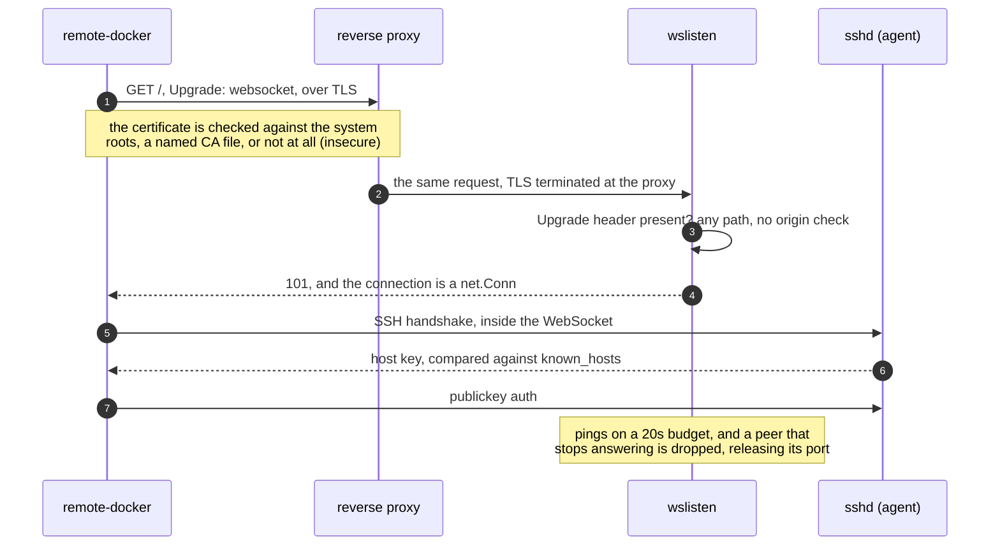

**S — which end TLS authenticates (1, 2).** TLS authenticates the *proxy*. The
workspace is authenticated by its SSH host key, inside the tunnel, and the
machine by its client key. So `insecure` and a plain `ws://` URL give up knowing
which proxy answered and give up nothing about whether the session itself is
authenticated and encrypted. `core-client/tunnelclient/websocket.go` states this at the top of
the package; `client/internal/config/transport.go` is where a scheme becomes a
dialler.

**I — the agent holds no certificate (3).** It serves `ws` and never `wss`
(`core-agent/wslisten`). TLS is the proxy's job, so the workspace has no
private key to protect, rotate or leak, and a deployment that wants TLS end to
end runs the proxy on the same host.

**T/S — no origin check, any path (4).** The upgrade is accepted regardless of
path and with `InsecureSkipVerify` on the WebSocket accept options, which turns
off the Origin comparison. That is safe here for a reason worth stating rather
than assuming: this endpoint has no ambient credential for a browser to ride.
There is no cookie and no session, and everything past the upgrade is an SSH
handshake that a page in a browser cannot perform. A non-upgrade request is
answered 426 rather than left hanging.

**D — what is exposed before authentication (1–7).** With an ingress this is
usually reachable from the internet, where an SSH port on a private network
was not. What is exposed is the WebSocket accept path and the SSH handshake:
`coder/websocket`, `gliderlabs/ssh` and `x/crypto/ssh`. There is no rate limit,
no connection cap and no fail2ban, so the honest statement is that unauthenticated
traffic reaches those libraries and stops at `PublicKeyHandler`. Keeping the
port private is worth more than anything here, which is why the SSH listener is
not published by the Kubernetes chart and the WebSocket is.

**D — a client that vanishes (8).** `sshd.armDeadPeerDetection` bounds a dead
TCP peer with keepalives and `TCP_USER_TIMEOUT`, and none of it applies to a
WebSocket, which is a wrapped connection rather than a `*net.TCPConn`. So
`wslisten` pings on the same budget. Without it a client that disappears keeps
its reverse-tunnel port reserved: the symptom is not a lost connection but a
later reconnect refused its own forward, with containers mounting against a port
bound to nothing. *Covered by* `wslisten` tests and `integration.sh` section 19,
which pauses a real proxy and waits for the agent to notice.

---

## Flow 3: a bind mount becomes an NFS volume

The flow the whole project exists for, and the one that puts the user's files
on the wire.

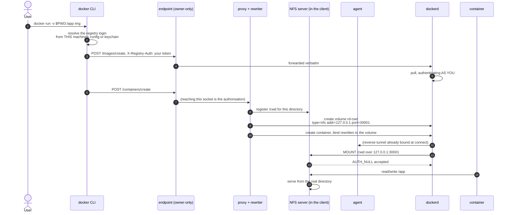

**E — anything that reaches the endpoint has the workspace (2, 3).** There is
no per-request authorisation: the Docker API is the authority, so a local
process that can open the socket can start a privileged container and mount any
path the user can read. The control is the endpoint itself: `0600` on unix
(`client/internal/proxy/listen_unix.go`), an owner-only SDDL on the Windows
named pipe (`listen_windows.go`), and never a TCP port. *Covered by*
`proxy` lock and listen tests.

**E — the endpoint now outlives idleness (1).** A session used to exit after 30
minutes unused, closing the endpoint with it. It now STANDS BY instead: the
workspace connection and the file watches are released, the endpoint stays
bound, and the next request rebuilds the session. So the window in which a
local process can reach that authority is no longer bounded by time — it lasts
until the session is stopped.

That is the intended behaviour, since the endpoint is what compose, buildx and
IDE plugins are told to use, and it is why the control above is the file
permissions rather than the lifetime. A deployment that wants the old bound
sets `daemonIdle`, which still ends the process. Note what standby does NOT
release: the endpoint answers while dormant, so reaching it wakes a session and
reopens the connection. Nothing is re-authorised at that point; waking is not
an authentication step.

**I — the export is unauthenticated (9, 10).** The NFS server answers
`AuthFlavorNull` (`core-client/nfsserve/server.go`): anything that can
reach the port can read and write every registered share. There is no second
control on the NFS layer, which is why the loopback rule in flow 4 and the
holder rule in flow 5 carry the whole weight.

**I — the share root handle is derived, not random (10).** A handle has to
survive a client restart or every running container reads `Stale file handle`
against a mount that still looks fine, so the root handle is derived from the
export path (ADR 0033, `core-client/nfsserve/handles.go`). It is therefore
predictable, and that costs nothing: MOUNT hands the same handle to anything
that reaches the port, so guessing it is not a way in that the port is not
already. *Covered by* `handles_test.go`.

**I — a container with host networking reaches the whole export (11, 12).** An
ordinary container has a network namespace of its own and reaches the export
only through what was mounted into it. A container the account runs with
`--network host` joins the daemon's namespace, where `127.0.0.1:<port>` is the
export answering `AUTH_NULL`: every directory that machine has shared in this
session, not only the ones mounted into that container. No boundary is crossed,
since it is the account's own export, and it does widen what an untrusted image
can read. The answer is the ordinary one: do not give an image you do not trust
host networking. *Covered by* `per-user-dind.sh` section 12, where the same
probe is run from a host-networked container and from a shell.

**I — your registry credentials leave this machine (2-5).** The daemon does the
pulling but has no logins of its own: the CLI resolves yours locally
(`RetrieveAuthTokenFromImage` against this machine's config or keychain) and
sends them in `X-Registry-Auth`, which the proxy forwards verbatim. So a
private pull hands a usable registry token to the workspace, where root can
read it out of the daemon's request. Encrypted in transit by SSH, exposed at
the far end to whoever runs the workspace. Nothing here mitigates that, and it
is the reason a workspace should be as trusted as the registries you use from
it. Docker works this way everywhere; it is only worth stating because here the
daemon is somebody else's.

**T — the workspace writing permissions onto this machine's files (10, 11).**
SETATTR is a real write now: a mode set through a share reaches the file, which
is what makes a binary built there runnable. So the workspace can change the
permission bits of any file in a share, including making one executable or
removing an owner's access. That is the point of the feature and inside the
share it is the account's own data, so no boundary is crossed.

The boundary that matters is the share's edge. `attrChange.resolve` joins the
name onto the share root and re-checks containment on the RESULT, because
`filepath.Join` cleans and `"../.."` looks ordinary afterwards. Ownership is
not writable at all: `Chown` and `Lchown` are accepted and discarded, since
ownership is synthesised, so no chmod/chown pair can hand a file to another
uid. *Covered by* `nfsserve/chmod_test.go` and `integration.sh` section 15d.

**Known gap: `os.Chmod` follows symlinks.** A symlink inside a share pointing
outside it is followed, so the workspace can set the mode of a file the share
does not contain — the containment check is lexical and sees only the link's own
path. Bounded by the client's own uid, so it reaches nothing the user cannot
already chmod, and it changes permissions rather than content. `core-agent/replay`
solved the same problem with `O_NOFOLLOW`; this path has no equivalent yet.

**I — the fileid is the real inode now (11).** A share reports device and inode
(volume and file reference on Windows) instead of a hash of the path, because a
number that moves under a live handle makes the client treat the file as
replaced. It tells the workspace which files are hard links of each other and
roughly how the client's filesystem is laid out. Both were already inferable
from the share's contents.

**T — a path outside the shares (10, 11).** The export namespace is virtual:
only `/cwd` and `/m/<16 hex>` resolve, and lookups that climb out of a share
return nothing. *Covered by* `nfsserve/registry_test.go`.

**T — the workspace naming an export this session never registered (10).** A
volume outlives a client process, so `compose up -d` on containers that already
exist mounts a volume nothing has registered (ADR 0027). The record that answers
it is a capability list, not a lookup table: the workspace names an id and the
client chooses among directories it wrote down itself, never a path the far side
supplied. `client/internal/session/shares.go` recomputes the id from the path
before believing an entry, refuses the whole file when another machine or
account wrote it, never restores `/cwd`, drops records unused for 30 days, and
restores only from a MOUNT that missed rather than from a lookup. *Covered by*
`shares_test.go` and `role_test.go`.

**T — a volume that is not ours (4).** Volumes are only ever created, never
rewritten onto a name the user chose; garbage collection requires both the
`rd-` prefix and the managed label, since somebody may legitimately name a
volume `rd-backups`. *Covered by* `rewrite/gc_test.go`.

**D — the collector deleting a live volume (4).** A volume exists before any
container names it, and the daemon calls it unused in that window. `rewrite.Guard`
holds one lock across registering the share and creating the volume. Losing
that race is silent: the daemon recreates the missing volume as an empty local
one and the container starts with an empty directory. *Covered by*
`rewrite/guard_test.go` and `integration.sh` section 16.

---

## Flow 4: binding the reverse tunnel, and the refusal

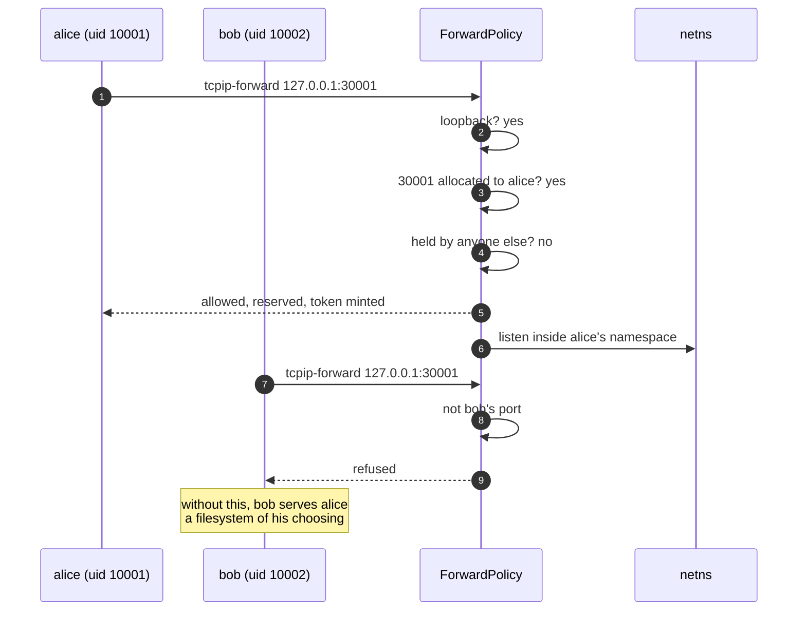

**S/E — serving another account's mounts (6–9).** `ForwardPolicy.Allow`
(`agent/internal/sshd/forward.go`) enforces three rules in order: loopback
only, a port this account was allocated and no other, one holder at a time. The
middle rule is the one that stops bob binding alice's port before she connects.
*Covered by* `forward_test.go` and `integration.sh` section 11.

**S — a port the client chose (2).** An account's first port is still derived
from its uid, and the rest are allocated by `accounts.Ports`, so `Allow` asks
the allocator rather than recomputing `PortForUID`, which would refuse a port
the agent had just handed out. The workspace also reads a port back off its own
volumes before choosing one for a machine it has forgotten (ADR 0032), so a
client-supplied address is never written into durable state.

**I — publishing the export beyond the container (2).** A non-loopback bind is
refused outright, because the export is unauthenticated and anything that
reaches it reads the client's files.

**D — losing a reservation on a failed bind (5, 6).** `Allow` is not a
predicate: it binds the port and arms the release. A listen that failed after
it once left the account's only port reserved by a forward that did not exist,
and every retry was refused while blaming a second session.

**E — releasing somebody else's reservation (5, 6).** The fix for D released by
ACCOUNT NAME, which is not who holds a port (ADR 0028). Opening the client on a
second machine was enough to reach it: the second session's bind fails, its
failure path releases, and the first machine's live reservation is deleted.
`AllowDial` below then finds the port unheld and permits any other account to
dial it, so control 4 of flow 5 stops holding while the export it protects is
still serving. A reservation now carries a token minted when it was taken, and
only that token releases it. `TestAFailedBindDoesNotReleaseTheLiveHolder` walks
the whole sequence, ending at the dial being refused.

**D — a reservation held by a client that is gone (5).** A client whose network
black-holes leaves a socket that is dead and looks alive for the fifteen minutes
Linux retransmits, so the reconnect is refused its own forward. Keepalives and
`TCP_USER_TIMEOUT` bound it (`sshd/deadpeer.go`), and a WebSocket bounds it with
pings instead (flow 2). *Covered by* `nfs-resilience.sh` and `integration.sh`
section 19.

---

## Flow 5: reaching a published port, and the gap this model found

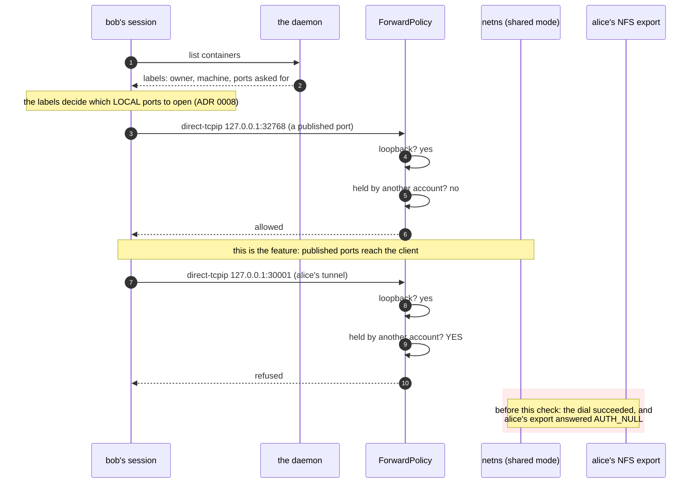

**I/E — reading another account's machine (8–10).** Found while writing this
document. With one daemon for everybody (ADR 0012) every account shares the
agent's network namespace, so `127.0.0.1:<alice's port>` is genuinely reachable
from bob's session, and what answers is her NFS export with `AuthFlavorNull`:
read and write access to the directories on her machine. Binding her port was
already refused; dialling it was not.

`ForwardPolicy.AllowDial` now refuses a port another account holds. It asks the
holder rather than a port range, because `PortForUID` counts up from 30000 and
docker publishes host ports from 32768, so refusing the range would refuse the
forwarding this feature exists for. *Covered by* `dial_test.go` and
`integration.sh` section 11, which uses the forward rather than merely
requesting it, since ssh opens the local listener before asking for the
channel.

**And what that control cannot reach, in the same mode.** `AllowDial` gates SSH
channels. An enrolled account also gets a shell in the workspace container
(`agent/internal/sshd/session.go`), as its own uid, in the namespace the exports
are bound in when there is one daemon for everybody. A socket opened there is an
ordinary connect: no channel is requested and no policy is asked. So in
shared-daemon mode an account can still speak NFS to another account's export
while that session is live, and no rule in `ForwardPolicy` can prevent it,
because the rules are about forwarding and this is not forwarding.

Two things follow, and neither is a patch to `AllowDial`:

- **The default mode does not have it.** A daemon per account (ADR 0019) binds
  each tunnel inside that account's own namespace, where no shell runs, so the
  export answers the daemon that must mount it and nothing else, including its
  own account's shell. `per-user-dind.sh` section 12 asserts exactly that, from
  both accounts' shells.
- **Shared mode rests on its stated assumption**, which ADR 0012 has always
  made: everyone enrolled in a workspace is mutually trusted. `integration.sh`
  section 11 probes it from a second account's shell and reports what it finds
  rather than failing, because it follows from the mode. It connects, which is
  how this stopped being an argument about namespaces and became a measurement.

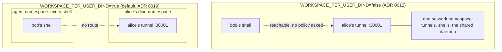

**D — the workspace as a network relay (4).** Non-loopback destinations are
refused, so the workspace cannot be used to reach the network it sits on
through the tunnel. Containers an account runs are not bound by that, and reach
whatever the workspace's network reaches.

**Datagrams ask the same question (3–6, ADR 0038).** UDP crosses the tunnel in
a channel of its own, and `AllowDial` answers for it unchanged: loopback only,
never a port another account holds. There is no second rule to keep in step, and
a datagram channel reaches nothing a `direct-tcpip` one could not. Two smaller
properties hold it up. The workspace's socket is *connected* to the container's
port, so the kernel drops anything from elsewhere and a reply can only reach the
sender whose flow it belongs to; and `ReadDatagram` reads the length off the
wire but never allocates from it, so a peer claiming 65535 bytes gets an error
rather than a buffer (`core/tunnel/datagram.go`).

**D — a datagram flow is reclaimed only when the forward ends (3–6).** One flow
per source address, and its lifetime is the forward's, which is the rule TCP
already follows (ADR 0038). A local sender that changes source port per datagram
therefore opens an SSH channel and a workspace socket per datagram, and nothing
releases them until the container stops. Forwards bind `127.0.0.1`, so this
needs a process on the user's own machine -- but a loopback port is reachable by
every local user, not only the owner, which the endpoint's file permissions are
what protect it from. Nothing bounds it today. The trigger for adding an idle
timeout is somebody watching the channel count climb, which is the same trigger
ADR 0038 already records.

**T/S — the client trusts labels any account can write (1–2).** Which containers
a client forwards, and since the port became the client's (ADR 0008) which LOCAL port it opens for them, are
read from labels on the container: the owner, the machine, and the ports asked
for. On a shared daemon any account can create a container carrying somebody
else's labels, so a hostile one can make another user's client open listeners on
their machine at numbers of the attacker's choosing, carrying the attacker's
service -- a plausible use of it is answering DNS or syslog on the loopback
address something else on that machine trusts. How MANY it can ask for is
bounded: `workspace.MaxRequestedPorts` caps one label at 1024 ports, which is
past any published range and far short of a label that asks a machine to open
every socket it has. WHICH numbers those are is not bounded and cannot be, since
any of them may be the one the user asked for.
This sits inside ADR 0012's stated assumption rather than outside it, and it is
one more thing the default mode does not have: with a daemon per account, the
labels a client reads were written by that account alone.

---

## Flow 6: replaying a change as a real syscall

The agent performs syscalls on the user's own files, as root, on instruction
from the client. ADR 0016 is why it exists; this is what keeps it safe.

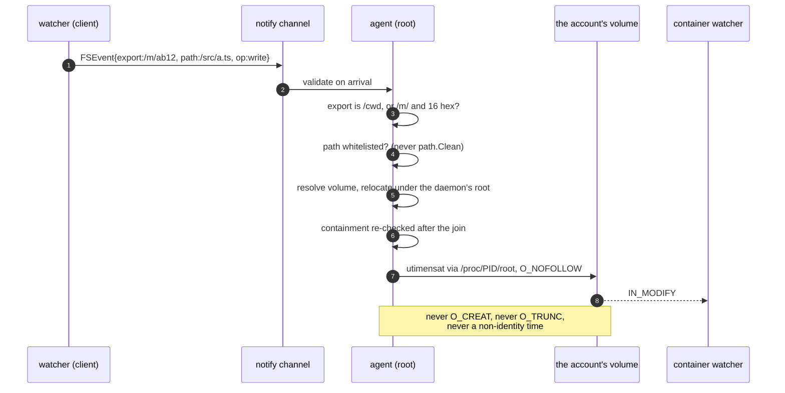

**T/E — a root process told which path to touch (2–7).** Two independent
checks. `notify.Event.Validate` (`core/notify/notify.go`) whitelists the
export and the path spelling, deliberately without `path.Clean`, because
cleaning *repairs* a traversal into something plausible instead of refusing it.
Then `relocate` re-checks containment after joining onto the daemon's root,
because `path.Join` cleans: `/proc/42/root` joined to `/../../etc/shadow` is
`/proc/etc/shadow`, outside the root and looking correct. *Covered by*
`core-agent/replay/relocate_test.go`.

**T — replay mutating the user's data (7).** Replay may never create, truncate
or change content: the file may have been deleted between the client observing
the change and the agent replaying it, and the cost of being wrong is data
appearing in somebody's project. `O_CREAT`, `O_TRUNC` and non-identity
`utimensat` are all forbidden, and the measured `IN_CREATE` from
`open(O_CREAT)` is deliberately unused. *Covered by* `notify_test.go` and
`integration.sh` section 11d, which pins which syscall produces which event.

**T — a per-account daemon's answers are untrusted (5).** The daemon reports
its own volume mountpoints and the account is root inside it, so its answers
are input, not fact. `O_NOFOLLOW` and `AT_SYMLINK_NOFOLLOW` stopped being
tidiness the moment those paths left the agent's own filesystem.

**I — the channel carries paths, not contents.** Shipping data here would make
this a sync, which ADR 0014 explicitly is not.

---

## Flow 7: Swarm elevation

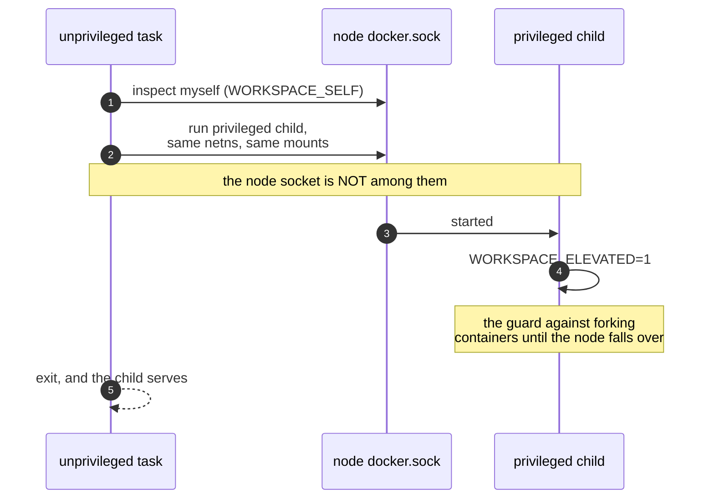

**E — the socket mount is the trust boundary (1, 2).** Access to the node's
Docker socket is root on the node. That is not a vulnerability introduced here:
whoever can deploy this stack can already start privileged containers. What
matters is that the socket is deliberately *not* replicated into the privileged
child, so a workspace account never reaches it. *Covered by*
`agent/internal/elevate/plan_test.go`.

**D — an elevation loop (5).** `WORKSPACE_ELEVATED` stops a misconfigured child
from elevating again and forking containers until the node dies.

---

## Flow 8: the workspace on Kubernetes

The same agent in a pod (ADR 0035). Only the way in and the surrounding
platform differ, so this flow is short and names only what is new.

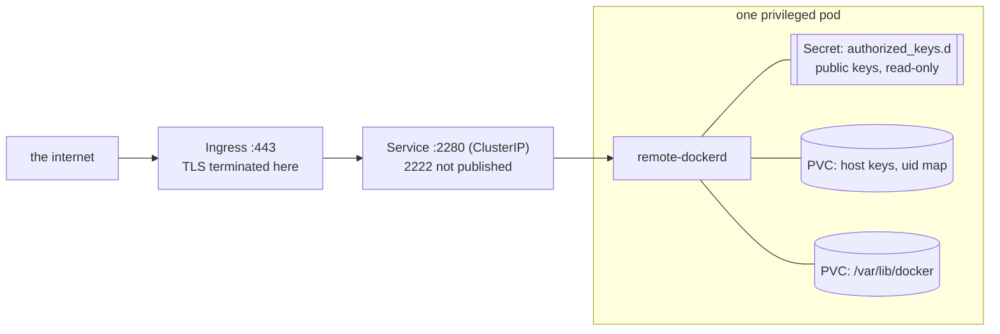

**S/D — the way in is usually public (1, 2).** An ingress on 443 is normally
reachable from the internet, so the pre-authentication surface in flow 2 is
exposed to everybody rather than to a network somebody controls. The SSH port
stays a ClusterIP and is reached with `kubectl port-forward` when it is wanted
at all.

**I — the Secret holds public keys (5).** `authorized_keys.d` is public keys
and nothing else, mounted read-only. Losing it costs an attacker nothing and
costs the operator their enrolment list.

**I — losing the state volume is not losing a cache (6).** It holds the SSH host
keys and the uid map. Restore the pod without it and every client that has
connected before refuses the new host key, and each account's uid moves, which
moves its tunnel port, which strands the volumes named after the old one.

**E — privileged is root on the node (4).** dockerd sets up its own bridge and
iptables rules and mounts NFS in its own namespace, so there is no unprivileged
mode. This is the same bargain as ADR 0013 on Swarm: whoever installs the chart
could already run privileged pods.

**E — a token an account could read (4).** Found while updating this document.
A projected ServiceAccount token is mounted at mode 0644, and an enrolled
account gets a shell in that container as its own uid, so it could read the
pod's cluster identity. The agent never calls the Kubernetes API, so the chart
now sets `automountServiceAccountToken: false` and there is no token to read.
There is still no Role and no ClusterRole.

**D/E — no NetworkPolicy (3, 4).** The chart ships none, so an account's
containers reach whatever the pod network reaches, which on most clusters is
every other service in it. A policy restricting egress is the operator's to
add, and worth adding on a shared cluster.

---

## Flow 9: the cache channel

The client ships file CONTENTS to the agent, which writes them as root inside an
account's daemon and removes files there on request. ADR 0044 is why it exists.

Deliberately the opposite of flow 6, and the contrast is the point: the notify
channel carries paths and mutates nothing, because it cannot know whether the
file it is told about still exists. This one carries bytes and mutates on
purpose, so its safety comes from where it is allowed to write rather than from
refusing to write at all.

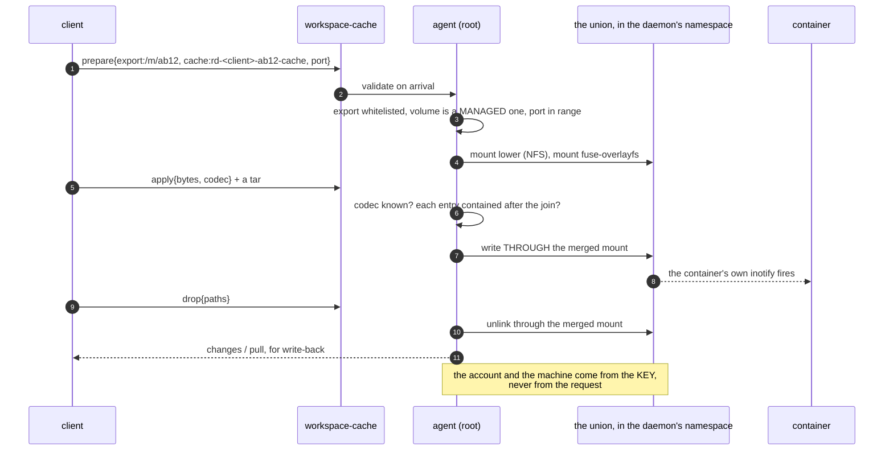

**T/E — a root process told which paths to write (3, 6).** Two independent
checks, exactly as flow 6. `cache.Request.Validate` whitelists the
export and every path without `path.Clean`, because cleaning *repairs* a
traversal into something plausible instead of refusing it. Then `within`
re-checks containment after the join, because `path.Join` cleans. Every tar
entry goes through the same `within` on its own name, so the archive is not a
way around the check that the request went through. *Covered by*
`core/cache/cache_test.go`.

**T — a drop removes files, which nothing else in this system may do (9).** The
Docker API can write into a volume and can never remove from one, which is the
whole reason the agent is involved rather than the client doing this itself. The
share root is refused by name: removing it is unmounting, and the mount's
lifetime is not the client's to end that way.

**E — a prepare naming a volume this machine did not create (3).** Two checks,
because one is not enough. `IsManagedVolume` keeps the agent from mounting a
volume this program never made, inside the account's daemon, as root. But every
machine of an account satisfies that for every OTHER machine's volumes, so the
agent also DERIVES the name it expects from the key's digest and refuses
anything else — otherwise a second machine could mount somebody else's cache as
its own upper and write into it through its own container. *Covered by*
`cache_test.go` and `agent/internal/unions`.

**S — the account and the machine are what the key established.** A request
names neither. The session's account comes from the authenticated key and the
machine is the digest of that key (ADR 0029), so one session cannot address
another account's union, and the manager keys every share on the pair.

**T — a payload naming a codec the agent has not got (5).** Refused rather than
read as a tar. The greeting says what this agent accepts, so an unknown codec is
a bug on the client's side, and decoding it as something else would put whatever
the bytes happened to be through the archive reader.

**I — write-back moves a container's output onto the user's own disk.** The one
direction here that writes outside the workspace, so it is gated twice: nothing
is written back while the cache is incomplete, because a file the fill never
sent cannot be told from one the container created; and every extracted path is
checked against the share root on the RESULT of the join, for the same reason as
above. A conflict is reported by path whichever way it resolves rather than
silently taking a side.

**I — `mounted` names cache volumes.** It answers with the asking machine's own
names: the ids come from the mounts and the digest from the key. An account's
machines already share a daemon and can list its volumes, so this exposes
nothing that `docker volume ls` did not.

**D — an apply is as large as the client says it is.** The frame's header is
bounded (`MaxCacheFrame`); the payload deliberately is not, because it is a tar
of somebody's project. What it consumes is that account's own graph volume, and
an enrolled account can already fill that from any container it starts. Listed
under accepted risks for that reason rather than defended against here.

---

## The software you run

Not an arrow in any flow, and it decides whether the arrows are the ones drawn
here.

**The image and the chart are signed.** The release workflow signs both by
digest with cosign keyless and attaches an SPDX SBOM as an attestation. The
identity in the certificate is the workflow at the tag that built it, so a
verification pins the artifact to this repository's release pipeline; the
commands are in `charts/remote-docker-workspace/README.md`. What a signature
does not say is that the code is correct, only that nobody replaced the artifact
after it was built.

**The client archives are not signed.** A GitHub release carries
`checksums.txt` and the archives, and the checksums are only as good as the
release they sit in: whoever could replace an archive could replace the file
listing its hash. Verify the checksum against a second source, or build from
source, if that matters to you.

**Chart `0.2.0` is unsigned**, because the signing step could not authenticate
to the registry it had just pushed to. Fixed for `0.2.1` and after; the tag
itself cannot be signed retrospectively without republishing it.

---

## Accepted risks

Stated here rather than buried, because each is a deliberate trade.

- **Reaching the local endpoint is total authority.** Any process running as
  the user can start containers on the workspace and mount anything the user
  can read. The endpoint is owner-only and never TCP; there is no second
  factor, and a compromised user account is a compromised workspace account.
- **The NFS export is unauthenticated.** `AUTH_NULL`, by design: the transport
  is a loopback-only reverse tunnel inside a namespace, and the controls are
  the forward rules and the namespace. If a deployment ever publishes that
  port, everything in flow 3 is exposed.
- **A public ingress means the SSH handshake is the whole gate.** No rate limit
  and no allow-list ship with the chart. An enrolled public key is the only way
  through, and a cluster that can restrict the ingress by source address should.
- **`insecure` gives up knowing which proxy answered.** It is per workspace and
  it does not weaken the SSH session inside, but a proxy you cannot identify is
  a proxy that can stop working for you and start working for somebody else.
- **A daemon per account is separation, not isolation.** Each per-account
  daemon runs privileged, which is root on whatever hosts it, so a determined
  account can still break out and reach another's. What it buys is that nobody
  sees anyone else's work *by accident* (ADR 0019). Genuine isolation is one
  workspace container per account.
- **In shared-daemon mode an account can reach another account's export.**
  Flow 5 has the mechanism. It is not fixable inside `ForwardPolicy`, and the
  answers are ADR 0012's stated assumption or the default mode.
- **A cache is as big as the project it caches.** An apply carries a tar of
  somebody's tree and the payload is not capped, because capping it would refuse
  a large project rather than protect anything: the bytes land in that account's
  own graph volume, which any container it starts can fill anyway. An operator
  who needs a bound wants a quota on that volume, not a limit here.
- **Whatever an operator mounts into per-account daemons, those accounts get.**
  `WORKSPACE_DIND_MOUNTS` exists so every account's daemon gets the same
  `daemon.json` or registry configuration, and an account is root inside its own
  daemon: anything with a credential in it is handed to everyone enrolled, so
  mount a pull secret there only if every account may pull with it. `ro` is opt
  in, and without it a shared file on the workspace is writable from inside
  every account's daemon -- `/etc/docker/daemon.json:/etc/docker/daemon.json:ro`
  rather than the same line without the suffix.
- **Two machines of one account collide on compose project names** (ADR 0029).
  Same account, same project name, same daemon: the second `compose up` adopts
  the first machine's containers rather than starting its own, and the mounts
  they carry point at the other machine's export. It is a correctness problem
  rather than a boundary one, since both machines are the same person, and the
  remedy is a distinct `COMPOSE_PROJECT_NAME` per machine.
- **Containers you run can write anything you shared with them**, and with host
  networking, anything you shared at all. That is the feature. A malicious image
  with `-v $HOME:/h` has your home directory.
- **A private pull gives the workspace a registry token of yours.** Flow 3 has
  the mechanism. There is no way around it while the remote daemon does the
  pulling, so treat a workspace as trusted with every registry you log into
  from it, and prefer tokens scoped to what that workspace needs.
- **A machine workspace is as trusted as the machine it runs on** (ADR 0026).
  The workspace is a VM on the user's own hardware, so the semi-trusted box and
  the trusted one share a computer, and anybody with administrator rights there
  is inside both.
- **Whoever deploys the stack is already root on the node** (ADR 0013), and
  whoever installs the chart is already able to run privileged pods.
- **No audit trail inside containers.** Sessions, forwards and refusals are
  logged; what a container did with a mounted directory is not.
- **Windows and macOS clients are less exercised.** The endpoint code and the
  file-watching backends are where they diverge. Windows takes a session end to
  end only in the machine workflow; macOS has never run a test of any kind.

## What changed because of this document

- **`ForwardPolicy.AllowDial`**: in shared-daemon mode one account could dial
  another's reverse-tunnel port and speak NFS to their client. Flow 5 has the
  detail, ADR 0012 records it as a property of that mode, and both a unit test
  and the shared-mode integration suite now cover it.
- **`automountServiceAccountToken: false` in the chart**: an enrolled account
  has a shell in the pod and could read its ServiceAccount token. Flow 8 has the
  detail and ADR 0035 records the decision.
- **`workspace.MaxRequestedPorts`**: a client opens local listeners at numbers
  taken from a container label, and on a shared daemon any account can write
  one. The numbers were range-checked and their count was not, so one label
  could ask a machine for as many sockets as it has. Capped at 1024, dropped
  the way the parser drops anything else it will not use. Flow 5 has the detail.
- **A datagram flow held until its forward ends** was found in the same pass and
  deliberately not changed: its lifetime is the forward's because TCP's is, and
  a second lifetime rule is a second thing to get wrong. ADR 0038 records the
  cost and the trigger that would change it.
- **A prepare may only name the asking machine's own cache volume.** Found
  writing flow 9. `CacheRequest.Validate` asks whether the volume is a MANAGED
  one, which every machine of an account satisfies for every other machine's
  volumes — one account's machines share a daemon (ADR 0029). So a second
  machine could have the agent mount somebody else's cache as the upper of its
  own union and write into it through its own container. The agent now derives
  the name from the key digest and compares, rather than trusting the one it was
  handed. Inside one account either way, and a narrowing worth having.
- **`os.Chmod` through a share follows symlinks.** Found writing the SETATTR
  entry in flow 3, and NOT fixed: the containment check is lexical, so a link
  inside a share pointing out of it is followed. Bounded by the client's own
  uid and limited to permission bits, where `core-agent/replay` solved the same
  problem with `O_NOFOLLOW`. Recorded rather than closed because the fix wants
  an openat-based path this package does not have yet.
- **The limit of `AllowDial`, written down and tested.** A shell reaches what a
  forwarding rule cannot gate. The default mode's namespace is what actually
  prevents it, so `per-user-dind.sh` now asserts a shell cannot reach the export
  and `integration.sh` reports the shared mode as it is.
